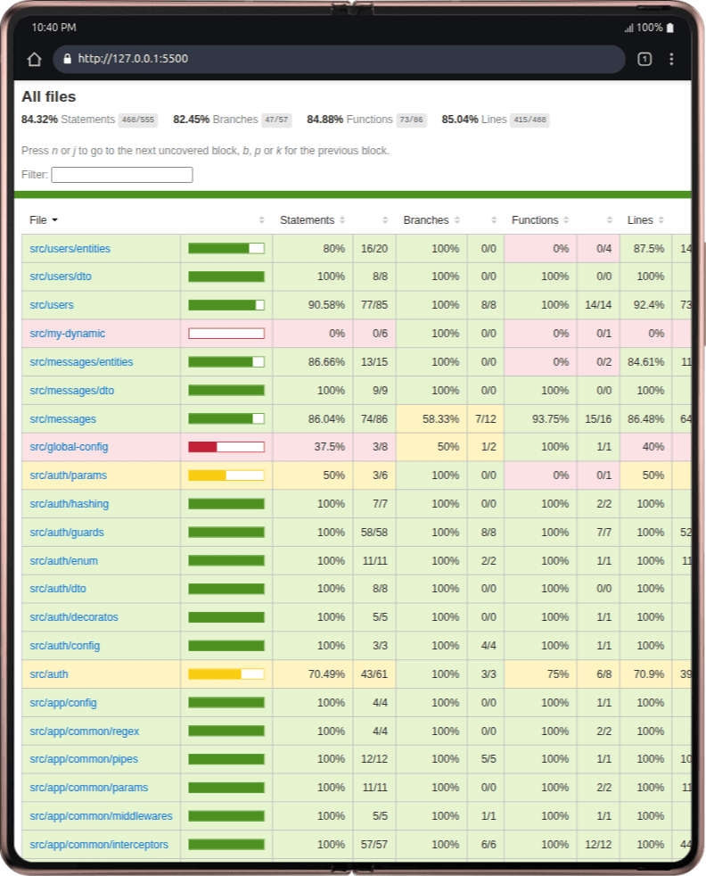

<p align="center">
  
</p>

# NestJS CRUD Project

A backend project built with [NestJS](https://nestjs.com/), featuring CRUD operations, JWT authentication, TypeORM, TypeScript, and automated tests.

---

## Stack & Tools

- [NestJS](https://nestjs.com/) — Backend framework
- [TypeORM](https://typeorm.io/) — Database ORM
- [PostgreSQL](https://www.postgresql.org/) — Relational database
- [TypeScript](https://www.typescriptlang.org/) — Typed JavaScript superset
- [Jest](https://jestjs.io/) — Unit and e2e testing
- [pnpm](https://pnpm.io/) — Package manager
- [Beekeeper Studio](https://www.beekeeperstudio.io/) — Database GUI

---

## Table of Contents

- [About the Project](#about-the-project)
- [Features](#features)
- [Installation](#installation)
- [Running the Project](#running-the-project)
- [Testing](#testing)
- [Main Endpoints](#main-endpoints)
- [Usage Examples](#usage-examples)

## About the Project

This project is a RESTful API developed with NestJS, TypeORM, and PostgreSQL, focused on CRUD operations for users and messages, with JWT authentication, image upload, and automated (unit and e2e) tests.

## Features

- User CRUD
- CRUD for messages between users
- JWT authentication (login and refresh)
- Profile picture upload
- Validations using class-validator
- Security with Helmet
- Message pagination
- Unit and integration tests (Jest)

## Installation

```bash
# Clone the repository
git clone <your-repo>.git
cd nestjs-crud

# Install dependencies
pnpm install
```

---

## Environment Variables

The `.env-example` file contains all the necessary environment variables to run the project, including database configurations, JWT, and environment settings. Copy and rename it to `.env` and adjust according to your environment.

Main variables:

- `PORT`: Application port
- `NODE_ENV`: Runtime environment (development, production, test)
- `DATABASE_*`: Database configurations
- `JWT_*`: JWT authentication configurations

Usage example:

```bash
cp .env-example .env
```

Edit the `.env` file according to your needs.

## Running the Project

```bash
# Development environment
pnpm run start:dev

# Production environment
pnpm run build
pnpm run start:prod
```

## Testing

This project uses **Jest** for both unit and end-to-end (e2e) tests:

- **Unit tests**: Test isolated functions, services, and business rules, ensuring that each part of the application works correctly independently.
- **End-to-end (e2e) tests**: Simulate real requests to the API, testing complete flows and integration between modules, database, and authentication.

### How to run the tests

```bash
# Unit tests
pnpm test

# Test coverage
pnpm run test:cov

# End-to-end tests
pnpm run test:e2e
```

### Test coverage

Below is a visual example of the project's test coverage:

<p align="center">
  
</p>

## Main Endpoints

### Authentication

- `POST /auth` — Login (returns accessToken and refreshToken)
- `POST /auth/refresh` — Token refresh

### Users

- `POST /users` — Create user
- `GET /users` — List users (requires JWT)
- `GET /users/:id` — Get user details (requires JWT)
- `PATCH /users/:id` — Update user (requires JWT)
- `DELETE /users/:id` — Delete user (requires JWT)
- `POST /users/upload-picture` — Upload profile picture (requires JWT)

### Messages

- `GET /messages` — List messages (with pagination)
- `GET /messages/:id` — Get message details
- `POST /messages` — Send message (requires JWT)
- `PATCH /messages/:id` — Update message (requires JWT)
- `DELETE /messages/:id` — Delete message (requires JWT)

## Usage Examples

### Login

```http
POST /auth
Content-Type: application/json
{
  "email": "user@email.com",
  "password": "123456"
}
```

### Create User

```http
POST /users
Content-Type: application/json
{
  "email": "user@email.com",
  "password": "123456",
  "name": "User"
}
```

### Send Message

```http
POST /messages
Authorization: Bearer <accessToken>
Content-Type: application/json
{
  "toId": 2,
  "text": "Hello!"
}
```

---

> Project developed by Fernando Hiroshi
